<h1 align="center">Kraft</h1>

<p align="center">
  Seven polished UI effects for Compose Multiplatform. They run on Android, iOS and desktop from one Kotlin codebase.
</p>

<p align="center">
  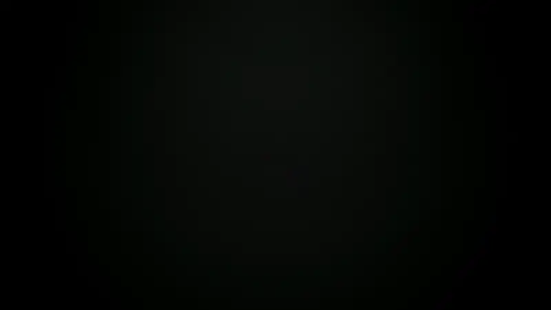
</p>

<p align="center">
  <!-- TODO: replace YOUR_VIDEO_ID with the YouTube video ID once the film is uploaded -->
  <a href="https://www.youtube.com/watch?v=YOUR_VIDEO_ID"><b>▶ Watch the 70-second film on YouTube</b></a>
</p>

---

## What is this?

[Libraries.dev](https://github.com/Jakubantalik/Libraries.dev) by Jakub Antalik is a set of good-looking UI effects for the web. It has border beams, thinking orbs, liquid metal buttons and more. I liked them and wanted them in my Compose apps, so I ported them.

Kraft contains two things:

1. **`:effects`**, a Compose Multiplatform library with all seven effects. Each effect is a plain composable that wraps your existing UI. You don't write shaders and there's no extra setup.
2. **The Kraft app**, a port of the Libraries.dev website itself. It has a landing page, a page for each effect with live previews, a playground with controls, and copyable code. It runs on Android, iOS and desktop.

Most of the work went into matching the originals. The thinking orbs are checked against the web engine's own golden data, down to the position of every dot. The other effects render the same scenes as upstream's parity harness, so you can put them next to the browser captures and compare them directly.

## How it was made (the honest part)

This project was **vibe coded** with **Claude Opus 5.5**. I wanted to see how far the model could get on something hard and visual, where you can't fake the result.

In practice, I described what I wanted, ran the app, compared it with the web version, and pushed back when something looked off. Claude wrote nearly all of the code, including:

- the effect ports, including turning Paper Design's liquid-metal GLSL shader into Kotlin,
- the parity and golden tests that check the ports against the originals,
- the app, navigation and design system,
- the showcase film in `film/`: every frame is rendered from the real composables, with a soundtrack synthesized in Python.

I'm publishing it as both a usable library and a record of the experiment. The code is real and the tests pass. Still, treat it like any code you didn't write yourself and read it before you ship it.

## The effects

| | |
|---|---|
| 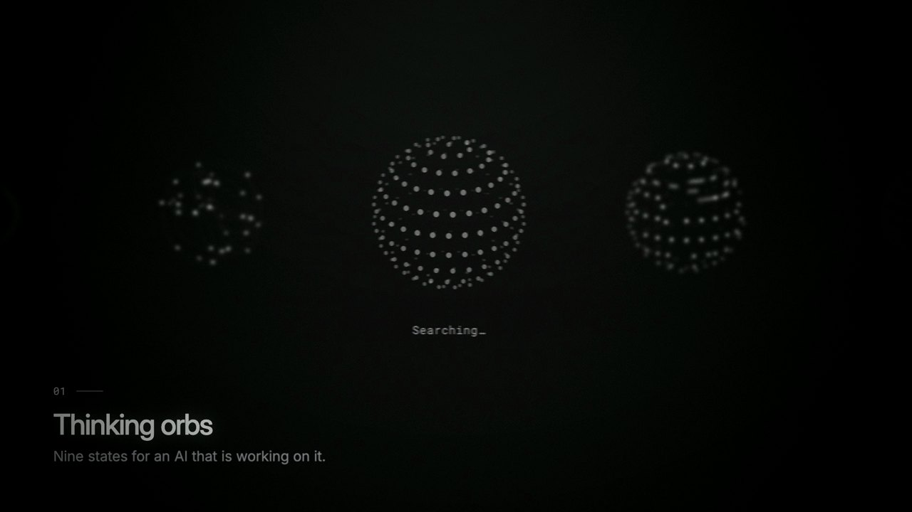<br>**Thinking orbs.** Nine animated loading states for an AI at work: Working, Searching, Solving, Listening and more. | 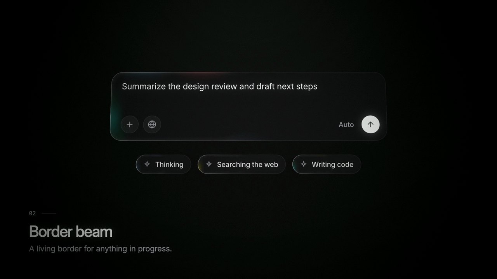<br>**Border beam.** A soft glow that travels around the border of anything in progress. |
| 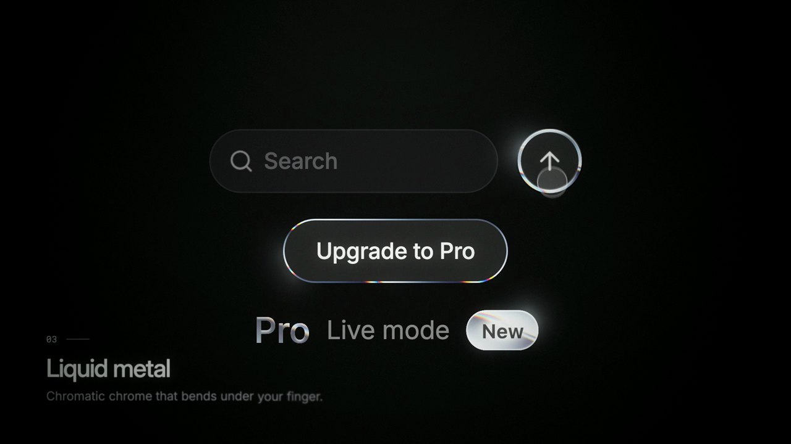<br>**Liquid metal.** Chrome buttons, badges and text that bend under your finger and reflect their neighbours. | 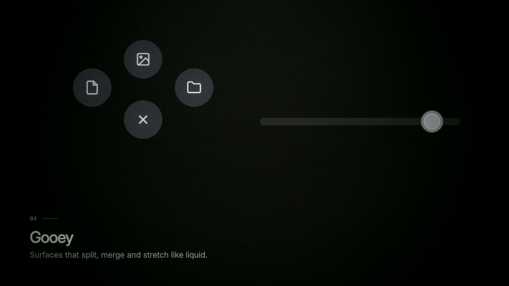<br>**Gooey.** Surfaces that split, merge and stretch like liquid. Good for menus that pop out of a button. |
| 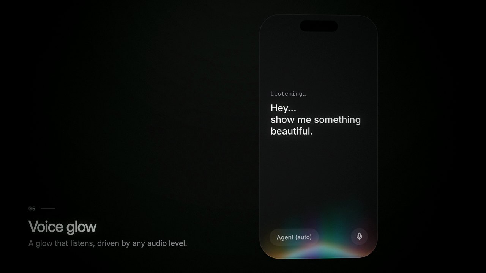<br>**Voice glow.** A glow that rises with your voice. It can use the real microphone or any audio level you give it. | 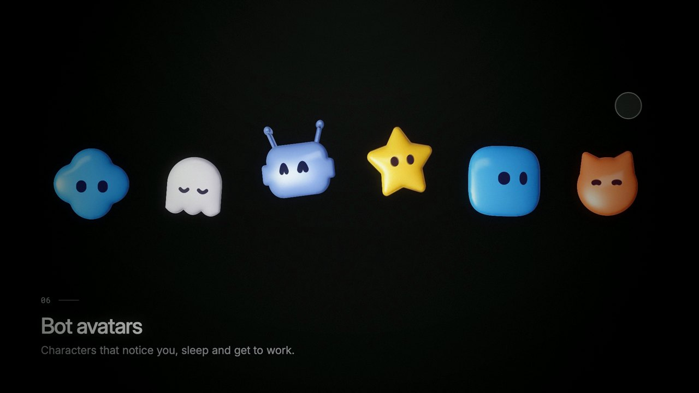<br>**Bot avatars.** 18 characters that blink, look around, sleep and get to work. |
| 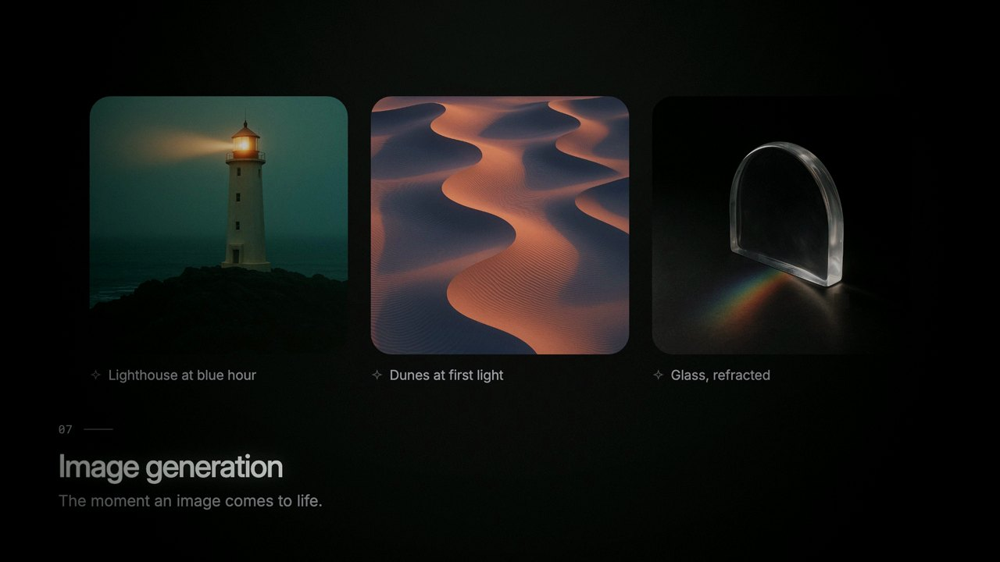<br>**Image generation.** A pixel-mosaic loader that turns into the finished image. | 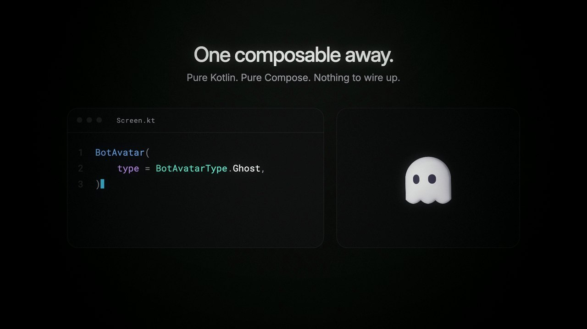<br>**One composable away.** Every effect is a single composable, and the same code runs on Android, iOS and desktop. |

## Screenshots

The app is a Compose port of the Libraries.dev site. These screenshots come straight from the app through the headless screenshot test, with the animation paused.

<p align="center">
  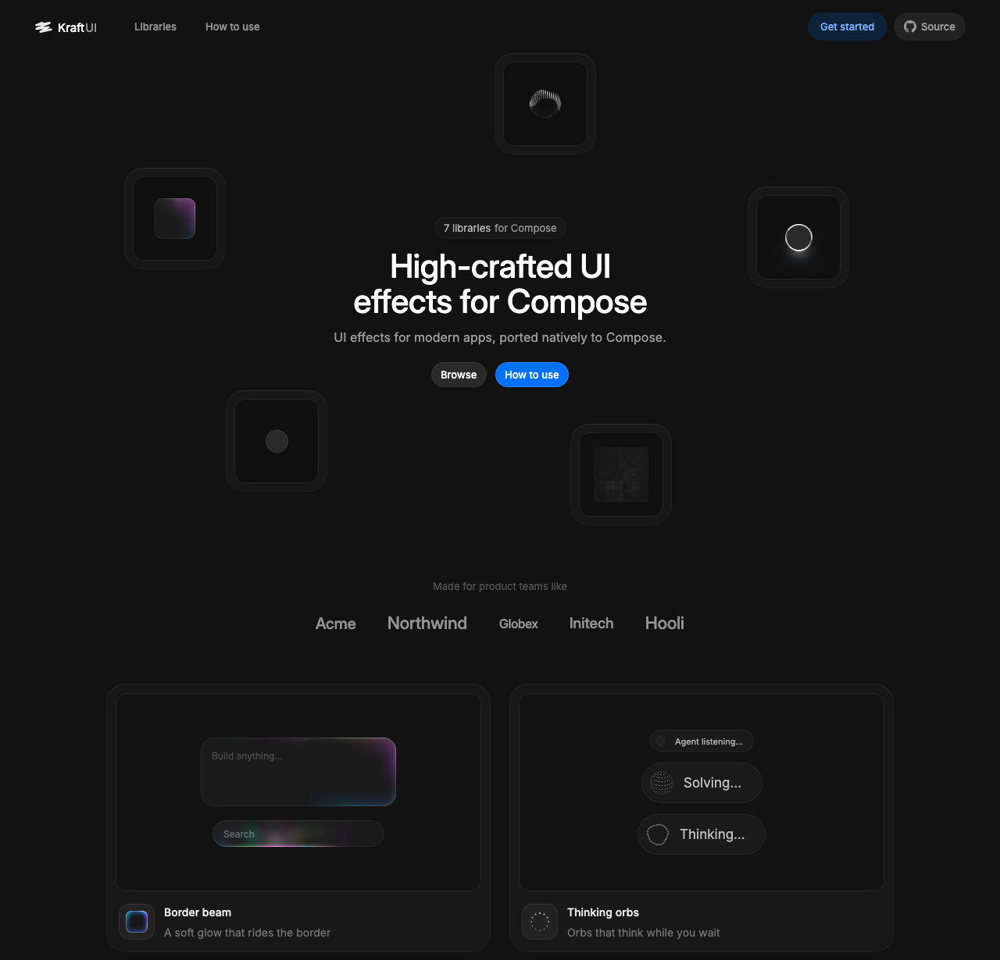
</p>

<p align="center">
  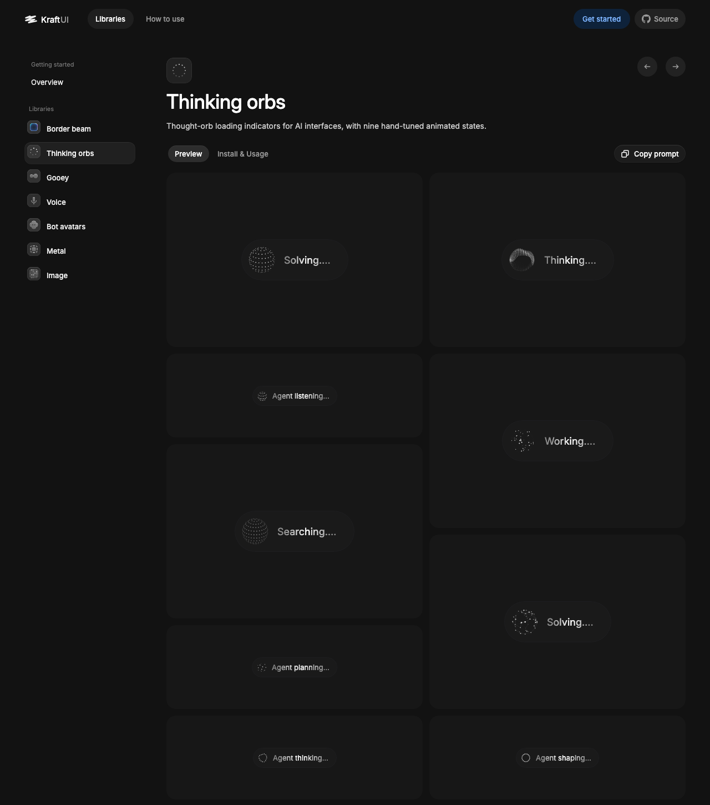
  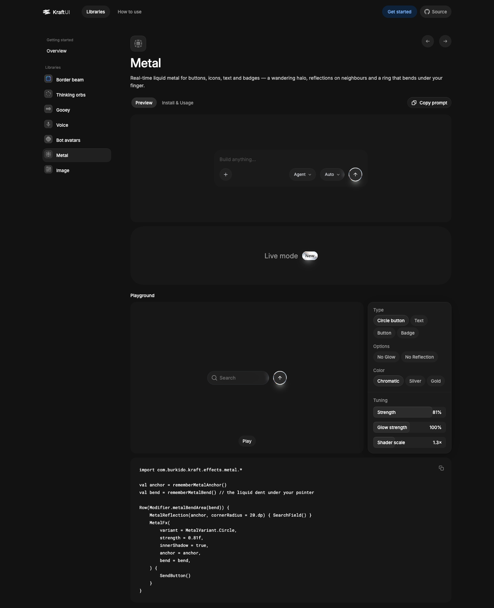
</p>

<p align="center">
  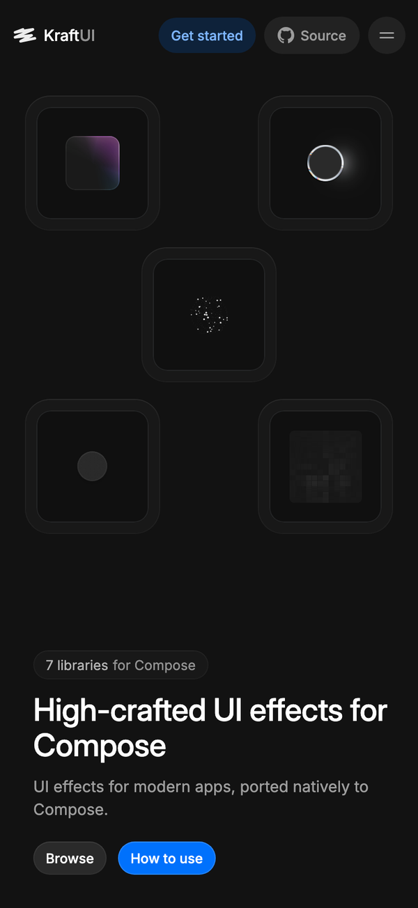
</p>

## Using the effects

Each effect wraps the UI you already have:

```kotlin
import com.burkido.kraft.effects.beam.BorderBeam
import com.burkido.kraft.effects.orbs.ThinkingOrb
import com.burkido.kraft.effects.orbs.OrbState
import com.burkido.kraft.effects.avatars.BotAvatar
import com.burkido.kraft.effects.avatars.BotAvatarType
import com.burkido.kraft.effects.metal.MetalFx

// A glowing border around a text field while the agent works
BorderBeam(active = isWorking) {
    PromptField()
}

// A thinking indicator
ThinkingOrb(state = OrbState.Searching)

// An animated face for your assistant
BotAvatar(type = BotAvatarType.Ghost, size = 48.dp)

// A liquid-metal send button
MetalFx {
    SendButton()
}
```

Every effect has more options for colour variants, themes, speed, strength and so on. The quickest way to explore them is to run the app, open an effect's page and play with the **Playground**. It prints the exact code for the configuration you pick.

Effects respect the system's reduced-motion setting and pause when they're off screen.

### Adding it to your project

**Kraft isn't published to Maven Central yet.** For now, use it as a source module:

1. Copy the `effects/` folder into your project.
2. Add `include(":effects")` to `settings.gradle.kts`.
3. Add `implementation(project(":effects"))` to your shared module's `commonMain` dependencies.

The module uses the Kotlin serialization plugin and Compose resources, so your version catalog needs the same plugins as the one in [`gradle/libs.versions.toml`](gradle/libs.versions.toml). If you'd like a published artifact, open an issue. If there's interest, I'll set one up.

## Running the app

You'll need:

- **JDK 17 or newer** (I use 21)
- **Android Studio** (recent enough for AGP 9.1) or IntelliJ IDEA with the Kotlin Multiplatform plugin
- **Xcode** for iOS (built with Xcode 26)

```sh
git clone https://github.com/burkido/Kraft.git
cd Kraft

# Desktop: the fastest way to look around
./gradlew :desktopApp:run

# Open a specific effect page directly
./gradlew :desktopApp:run --args="--library metal"   # beam, orbs, gooey, voice, bots, metal, image

# Desktop with Compose Hot Reload
./gradlew :desktopApp:hotRun

# Android
./gradlew :androidApp:installDebug
```

For **iOS**, open `iosApp/iosApp.xcodeproj` in Xcode and run it. If you want to run on a real device, set your `TEAM_ID` in `iosApp/Configuration/Config.xcconfig`.

The Voice page's playground asks for microphone access so the glow can follow your voice. The demos above it run on a built-in level, so you can skip the mic and still see everything.

## Project structure

```
effects/      The library: the seven effects, as a Compose Multiplatform module
shared/       The Kraft app (landing page, effect pages, playgrounds, design system)
androidApp/   Android entry point
iosApp/       iOS entry point (Xcode project)
desktopApp/   Desktop (JVM) entry point
film/         The showcase film, rendered offline from the real composables
docs/media/   Images used in this README
```

## Tests

```sh
./gradlew :effects:jvmTest :shared:jvmTest
```

This runs three kinds of check:

- **Orb golden test.** Checks the orbs against upstream's golden vectors: 9 states × 2 sizes × 4 timestamps, every dot.
- **Parity renders.** Draw each effect in upstream's parity scenes and save PNGs to `effects/build/parity/` for comparison with the web.
- **`ScreenshotRender`.** Renders every app page headlessly into `shared/build/screens/`. The screenshots above came from there.

## The film

<p align="center">
  <a href="https://www.youtube.com/watch?v=YOUR_VIDEO_ID">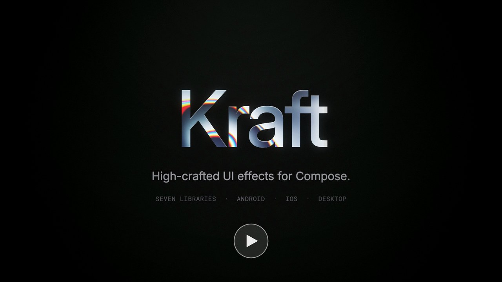</a>
</p>

The film isn't a screen recording. `film/` is a small renderer that runs each shot as a Compose scene offscreen, on a virtual clock, one frame at a time, and pipes the frames into ffmpeg. A scripted "hand" provides the touches. The music and sound effects are synthesized in Python without samples, and every run produces identical output.

```sh
film/tools/render.sh final 4          # render all shots at 1080p60, 4 JVMs in parallel
python film/tools/score.py            # the soundtrack
python film/tools/assemble.py final   # cut, grade and mux -> film/build/Kraft-final.mp4
```

You need `ffmpeg` on your path and `numpy scipy soundfile` for Python. The generated images and the voice line in `film/assets/` were made with OpenAI models and are checked in, so no API key is needed to render. [`film/README.md`](film/README.md) has the details.

## Known limitations

- Not on Maven Central yet (see above). The API may change.
- The landing page's company logos and testimonials are placeholder content, not real customers or quotes.
- The target is close parity with the web originals, and a few small visual differences remain. Please file an issue if you spot one.

## Contributing

Issues and pull requests are welcome, whether it's a bug, a parity difference, a new platform target or an idea for an effect. For a bigger change, please open an issue first so we can talk it through.

## Credits

- **[Libraries.dev](https://github.com/Jakubantalik/Libraries.dev)** by Jakub Antalik (MIT). The effects and the app are ports of its packages and website, including its spec data, bot shapes and demo images. Kraft wouldn't exist without it.
- **[Paper Shaders](https://github.com/paper-design/shaders)** by Paper Design (Apache 2.0). The liquid-metal material is a Kotlin port of its `liquidMetal` shader.
- **[Inter](https://github.com/rsms/inter)** and **[Roboto Mono](https://github.com/googlefonts/robotomono)** fonts (SIL OFL 1.1).
- Written with **Claude Opus 5.5**.

See [`NOTICE`](NOTICE) for exactly what came from where.

## License

Kraft is released under the [MIT License](LICENSE). You can use it in personal and commercial projects, modify it and redistribute it. Third-party parts keep their own licences, which are listed in [`NOTICE`](NOTICE). Their full texts ship with the app in [`shared/src/commonMain/composeResources/files/licenses/`](shared/src/commonMain/composeResources/files/licenses/).
